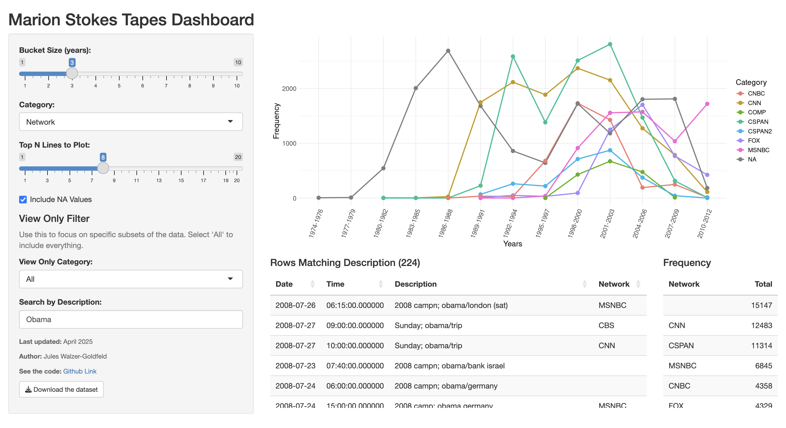

# Marion Stokes Tapes Dashboard

An interactive dashboard for exploring and analyzing television news data from the Marion Stokes tapes archive. I worked on this project in collaboration with Daniel Fernandez, a history student at The New School working on his senior thesis: **Marion Stokes: An Archivist Out Of Place​**.



## About the Project

This Shiny dashboard provides tools to visualize and analyze television news data from the Marion Stokes archive. The dashboard allows users to:

- Explore frequency distributions of different categories (like channel networks)
- Adjust time bucket sizes for temporal analysis
- Filter data by specific categories
- View top N items in interactive tables

## Data Source

The data backing this dashboard comes from the Marion Stokes Television News Archive:

[Marion Stokes Archive on archive.org](https://archive.org/details/marionstokes_201706)

## Live Dashboard

Access the live dashboard here:

[Marion Stokes Tapes Dashboard](https://jules-dev.shinyapps.io/Marion-Stokes-Tapes-Dashboard/)

## Code Structure

The dashboard consists of:

1. Data cleaning script (`superClean.R`)
2. Shiny app with UI and server components

### Main Features

- Interactive frequency plots with adjustable time buckets
- Dynamic filtering options
- Interactive data tables
- Search for tapes by description

## Installation & Usage

To run this dashboard locally:

1. Clone this repository
2. Ensure you have R and the required packages installed
3. Run the Shiny app

### Required R Packages

```r
install.packages(c("shiny", "ggplot2", "data.table", "DT"))
```


### Running the App
```r
source("superClean.R")
shiny::runApp()
```

## How to Use

1. Select a category from the dropdown menu
2. Adjust the bucket size (years) to group temporal data
3. Choose how many top items to display
4. Use the "View Only" filters to focus on specific subsets
5. The plot and table will update automatically
6. Search for specific entries by filtering by text in the description field

## Downloads
There are three datasets available to download
- `Datasets/dataset_all_tapes.csv` contains all tapes in the original spreadsheet of Marion's tapes on the Internet Archive
- `Datasets/dataset_with_dates_only.csv` contains only tapes with dates in computer-readable format. The Shinyapps dashboard is based on this dataset
- `Marion Stokes videocassette.xlsx` contains the original dataset found in the internet archive [here](https://archive.org/details/marionstokes_201706)
